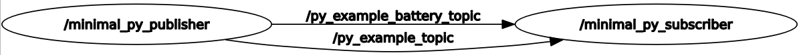
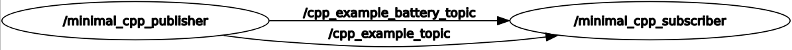
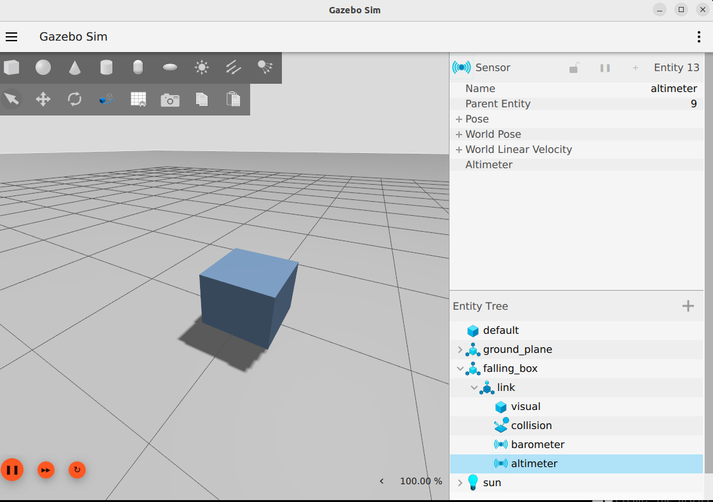
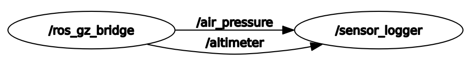
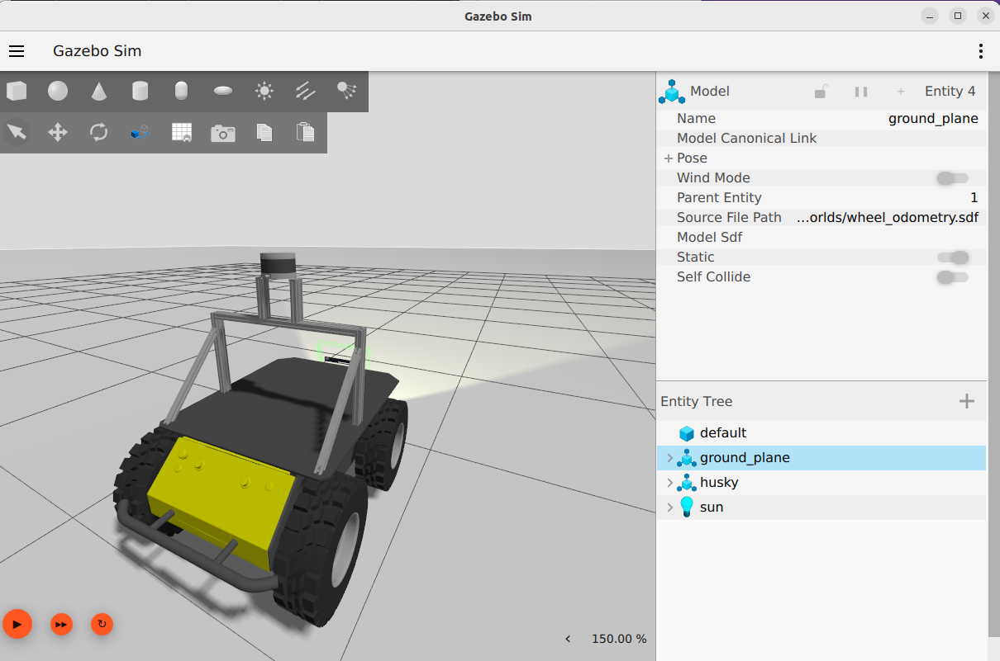
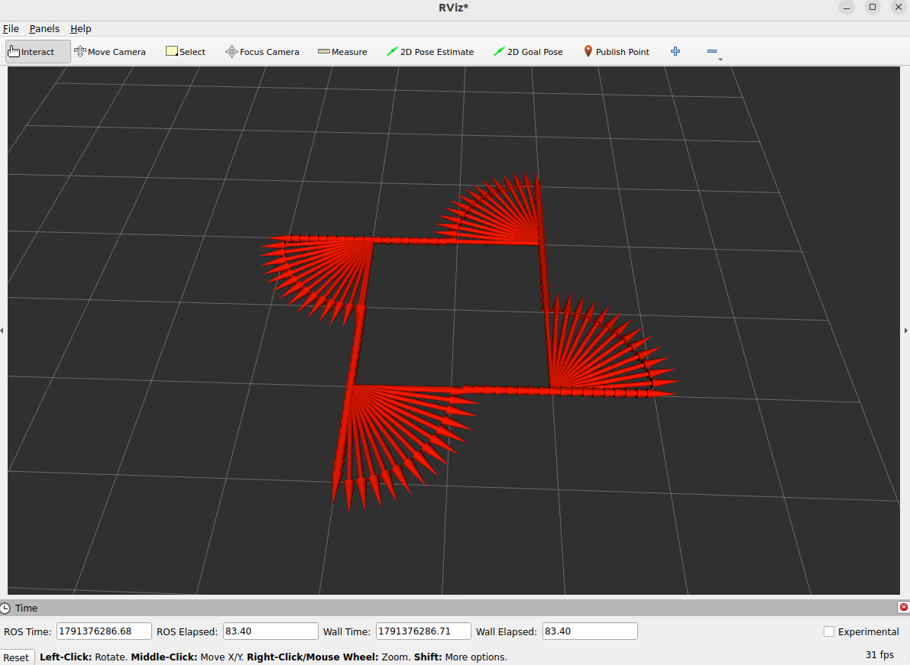

# ROS 2 Jazzy + Gazebo Harmonic Dev Environment

A Dockerized ROS 2 Jazzy workspace (Ubuntu 24.04) with GUI passthrough for
Gazebo/RViz/rqt, used to work through ROS 2 fundamentals and simulated
robots with sensors.

## Quick start

```bash
cd $HOME/Projects/ros2_fundamentals          # make sure it matches your local path
export UID=$(id -u) && export GID=$(id -g)  # container user matches your host user
docker compose build
docker compose up -d
docker compose exec ros2 bash
```

Optional aliases:

```bash
alias docker-ros-build="cd ${HOME}/Projects/ros2_fundamentals && docker compose build"
alias docker-ros-up="cd ${HOME}/Projects/ros2_fundamentals && docker compose up -d"
alias docker-ros-bash="cd ${HOME}/Projects/ros2_fundamentals && docker compose up -d && docker compose exec ros2 bash"
```

Once inside the container:

```bash
cd /ros2_ws
colcon build
source install/setup.bash
```

## Layout

```
.
├── docker-compose.yml
├── docker/                       # Dockerfile, entrypoint, shell aliases
└── ros2_ws/
    └── src/
        ├── ros2_fundamentals_examples/   # minimal pub/sub (Python + C++)
        ├── gazebo_falling_box/           # Gazebo sim + sensor bridge
        └── wheel_odometry/               # Husky diff-drive + /odom → CSV (Lab 1)
```

`ros2_ws/` is bind-mounted into the container, so `build/`, `install/`, and
`log/` persist on the host across restarts. `/opt/ros/jazzy/setup.bash` is
sourced automatically by the entrypoint, and `install/setup.bash` too once
you've run `colcon build`.

## Examples

### 1. Minimal publisher/subscriber

Python:

```bash
ros2 run ros2_fundamentals_examples py_minimal_publisher.py
ros2 run ros2_fundamentals_examples py_minimal_subscriber.py
# or both at once:
./src/ros2_fundamentals_examples/scripts/minimal_py_pub_sub_launch.sh
```



C++:

```bash
ros2 run ros2_fundamentals_examples cpp_minimal_publisher
ros2 run ros2_fundamentals_examples cpp_minimal_subscriber
# or both at once:
./src/ros2_fundamentals_examples/scripts/minimal_cpp_pub_sub_launch.sh
```



### 2. Gazebo falling box + sensor bridge

A box falls under physics in a Gazebo Harmonic world, carrying a barometer
sensor. `ros_gz_bridge` forwards its air-pressure/altimeter readings onto
ROS 2 topics, which a `sensor_logger` node subscribes to and logs.

```bash
ros2 launch gazebo_falling_box falling_box.launch.py
```




### 3. Wheel odometry: Husky driven from ROS 2

A Clearpath Husky from Gazebo Fuel with a diff-drive plugin. `/cmd_vel` and
`/odom` are bridged to ROS 2, and a C++ `odom_processor` node logs the
odometry to a CSV. Drive it by keyboard (`teleop_twist_keyboard`) or with
`ros2 topic pub`.

```bash
ros2 launch wheel_odometry wheel_odometry.launch.py run:=keyboard   # keyboard_odom.csv, keyboard_truth.csv
ros2 run teleop_twist_keyboard teleop_twist_keyboard   # second terminal
```




The scripted drive, the odometry-vs-truth plot, and the full run instructions
are in [`ros2_ws/src/wheel_odometry/README.md`](ros2_ws/src/wheel_odometry/README.md).

## Custom aliases / shell helpers

`docker/utils.sh` is baked into the image and sourced automatically from
`~/.bashrc` in every interactive shell — add your own ROS 2 aliases/functions
there (e.g. `alias build='colcon build'`) and rebuild (`docker compose build`)
to pick up changes.
