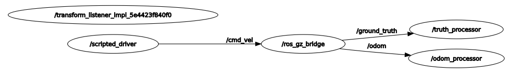
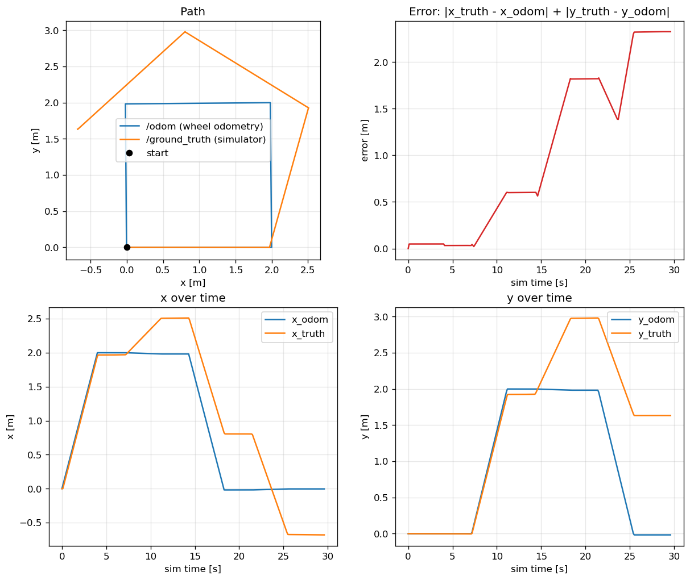

# wheel_odometry

A Clearpath Husky from Gazebo Fuel, driven from ROS 2 by its diff-drive plugin
and read back as wheel odometry. The package compares the wheel odometry with
the true pose from the simulator, and shows how far the odometry drifts.

## What is in the package

| Part | Function |
|---|---|
| [`worlds/wheel_odometry.sdf`](worlds/wheel_odometry.sdf) | Ground plane and the Husky. The `DiffDrive` plugin reads `cmd_vel` and publishes wheel odometry. The `OdometryPublisher` plugin publishes the true pose in the `world` frame. |
| [`config/bridge.yaml`](config/bridge.yaml) | `ros_gz_bridge` topics: `/cmd_vel` (ROS → Gazebo), and `/odom`, `/ground_truth`, `/clock` (Gazebo → ROS). |
| `odom_processor` ([`src/odom_processor.cpp`](src/odom_processor.cpp)) | Subscribes to `/odom`. Writes `t,x,y,yaw,v,w` to a CSV every 0.1 s of sim time. The launch files start it two times: `odom_processor` for `/odom`, and `truth_processor` for `/ground_truth`. |
| `scripted_driver` ([`src/scripted_driver.cpp`](src/scripted_driver.cpp)) | Publishes `/cmd_vel` for a fixed "drive straight, then turn" pattern, and then stops. |
| [`scripts/plot_odom.py`](scripts/plot_odom.py) | Reads the two CSVs, prints the final error, and saves a 2×2 plot. |
| [`launch/`](launch/) | `wheel_odometry.launch.py` (manual drive) and `scripted_drive.launch.py` (scripted drive). |

All nodes use sim time (`use_sim_time: true`), so the CSV time stamps agree.

## Run

From a fresh clone, on the host (see the [top-level README](../../../README.md)
for Docker details):

```bash
git clone <this repo> ~/Projects/ros2_fundamentals && cd ~/Projects/ros2_fundamentals
export UID=$(id -u) && export GID=$(id -g)
docker compose build && docker compose up -d
docker compose exec ros2 bash
```

Inside the container:

```bash
cd /ros2_ws
rosdep install --from-paths src --ignore-src -y
colcon build --packages-select wheel_odometry
source install/setup.bash
```

The first launch downloads the Husky model from Fuel, so it needs network access.

### Launch files

Both launch files take a `run` argument (default `run`). The loggers write
`<run>_odom.csv` (wheel odometry) and `<run>_truth.csv` (Gazebo ground truth)
to the current directory.

#### `wheel_odometry.launch.py`: manual drive

Starts Gazebo, the bridge, `odom_processor`, and `truth_processor`. Nothing
drives the Husky. You send `/cmd_vel` yourself. Stop it with Ctrl-C.

```bash
# Terminal 1: writes keyboard_odom.csv and keyboard_truth.csv
ros2 launch wheel_odometry wheel_odometry.launch.py run:=keyboard
```

Drive it from a second `docker compose exec ros2 bash`, in one of two ways:

```bash
# Keyboard: i forward, j/l turn, k stop. Keep this terminal focused.
ros2 run teleop_twist_keyboard teleop_twist_keyboard

# Command line: 0.5 m/s forward (60 messages at 10 Hz), then stop
ros2 topic pub -w 1 -t 60 -r 10 /cmd_vel geometry_msgs/msg/Twist "{linear: {x: 0.5}}"
ros2 topic pub --once /cmd_vel geometry_msgs/msg/Twist "{}"
```

#### `scripted_drive.launch.py`: repeatable scripted drive

Includes `wheel_odometry.launch.py` and adds `scripted_driver`. The driver
repeats "drive straight, then turn in place" `repetitions` times, and then
stops. When the driver exits, the launch stops all nodes and Gazebo. The
default values drive a 2 m square.

| Argument | Default | Meaning |
|---|---|---|
| `speed` | `0.5` | Forward speed, m/s |
| `drive_time` | `4.0` | Straight segment duration, s (sim time) |
| `turn_rate` | `0.5` | Turn rate, rad/s |
| `turn_angle_deg` | `90.0` | Turn angle for each repetition, degrees |
| `repetitions` | `4` | Number of drive + turn segments |

```bash
# Default 2 m square: writes square_odom.csv and square_truth.csv
ros2 launch wheel_odometry scripted_drive.launch.py run:=square

# 5 m straight line, no turn
ros2 launch wheel_odometry scripted_drive.launch.py run:=line \
  drive_time:=10.0 turn_angle_deg:=0.0 repetitions:=1

# Full circle in place
ros2 launch wheel_odometry scripted_drive.launch.py run:=spin \
  drive_time:=0.0 turn_angle_deg:=360.0 repetitions:=1
```

At the end, the launch shows `[ERROR] [gazebo-1]: process has died ... exit code -2`.
This is correct: `-2` is SIGINT from the shutdown, not a crash.

### Plot a run

`plot_odom.py` reads the two CSVs of one run. It prints the final position and
heading of each source, and the final error. It also saves a PNG with 4 charts:

| Position | Chart |
|---|---|
| Top left | Path: `/odom` and `/ground_truth` in the x-y plane |
| Top right | Error over time: `|x_truth - x_odom| + |y_truth - y_odom|` |
| Bottom left | `x_odom` and `x_truth` over time |
| Bottom right | `y_odom` and `y_truth` over time |

The script resamples the truth at the odometry time stamps. Thus, a row in one
CSV does not have to agree with the same row in the other CSV.

```bash
ros2 launch wheel_odometry scripted_drive.launch.py run:=square
ros2 run wheel_odometry plot_odom.py square_odom.csv square_truth.csv -o odom_vs_truth_square.png
```

### View a run live

Use these tools while a launch runs:

```bash
rviz2              # Fixed Frame: husky/odom, then Add → By topic → /odom → Odometry
ros2 run plotjuggler plotjuggler   # Streaming → ROS2 Topic Subscriber → /odom, /ground_truth
rqt_graph
```

You must type the RViz fixed frame `husky/odom` manually. No node publishes TF
yet. Thus, RViz can show `/odom` only in the `frame_id` of the message.

## Results


The world in Gazebo Sim: a ground plane and the Husky from Fuel.



`rqt_graph` during a scripted drive. `scripted_driver` publishes `/cmd_vel` to
`ros_gz_bridge`. The bridge publishes `/odom` to `odom_processor` and
`/ground_truth` to `truth_processor`. Gazebo is not in the graph, because it is
not a ROS node. The bridge connects to Gazebo through Gazebo transport. The
`transform_listener_impl_…` node has no connections. It is the internal TF
listener of RViz.


RViz, fixed frame `husky/odom`, during the default scripted drive. There is one
arrow for each `/odom` message. The arrows go along the straight segments and
make a fan at each turn in place. The wheel odometry shows a closed 2 m square.



`plot_odom.py` output for the same default square. Summary from the script:

```
final          x       y  turned deg
odom      -0.004  -0.017       360.4
truth     -0.680   1.633       295.9

final error (truth - odom): 1.783 m, -64.5 deg
real turn / odom turn:      0.821
```

- The straight segments agree. Each segment is approximately 2 m in the odometry
  and in the truth. The error stays below 0.06 m on the first segment.
- The turns do not agree. The odometry calculates each turn from the wheel speeds,
  and it shows 4 × 90°. The true robot turned only 296° in total, which is 0.82
  of the odometry value. A four-wheel skid-steer robot must slip its wheels to
  turn in place. The odometry does not measure this slip.
- A heading error makes all of the subsequent segments go in the wrong direction.
  Thus, the position error increases after each turn, and the true path is not
  a closed square. The final position error is 1.78 m after an 8 m drive.
