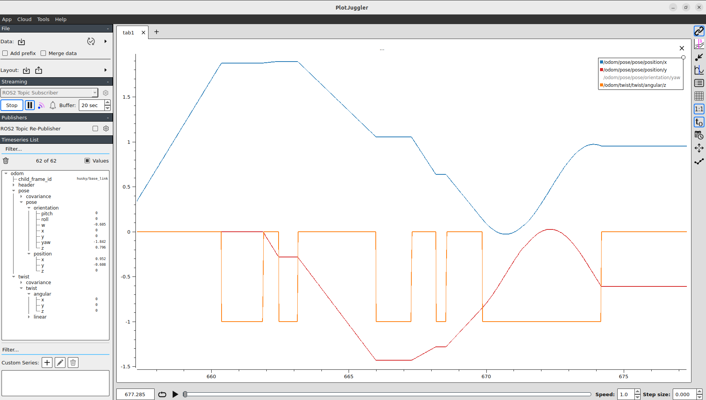

# wheel_odometry

A Clearpath Husky from Gazebo Fuel, driven from ROS 2 by its diff-drive plugin
and read back as wheel odometry. `ros_gz_bridge` connects `/cmd_vel` and
`/odom` to Gazebo. A C++ node, `odom_processor`, logs every `/odom` message
and writes the pose and twist to a CSV every 0.1 s of sim time.

## Run

From a fresh clone, on the host (see the [top-level README](../../../README.md)
for Docker details):

```bash
git clone <this repo> ~/Projects/ros2_fundamentals && cd ~/Projects/ros2_fundamentals
export UID=$(id -u) && export GID=$(id -g)
docker compose build && docker compose up -d
docker compose exec ros2 bash
```

Inside the container:

```bash
cd /ros2_ws
rosdep install --from-paths src --ignore-src -y
colcon build --packages-select wheel_odometry
source install/setup.bash

# Terminal 1: Gazebo + bridge + odom_processor. The CSV path is relative to the current directory.
ros2 launch wheel_odometry wheel_odometry.launch.py csv_path:=keyboard.csv
```

The first launch downloads the Husky model from Fuel, so it needs network access.

Drive it from a second `docker compose exec ros2 bash`, in one of two ways:

```bash
# Keyboard: i forward, j/l turn, k stop. Keep this terminal focused.
ros2 run teleop_twist_keyboard teleop_twist_keyboard

# Command line: 0.5 m/s forward (60 messages at 10 Hz), then stop
ros2 topic pub -w 1 -t 60 -r 10 /cmd_vel geometry_msgs/msg/Twist "{linear: {x: 0.5}}"
ros2 topic pub --once /cmd_vel geometry_msgs/msg/Twist "{}"
```

To view it:

```bash
rviz2              # Fixed Frame: husky/odom, then Add → By topic → /odom → Odometry
ros2 run plotjuggler plotjuggler   # Streaming → ROS2 Topic Subscriber → /odom
```

RViz needs the fixed frame typed in as `husky/odom`. Nothing publishes TF yet,
so the message's own `frame_id` is the only frame RViz can draw `/odom` in.

## See


The world in Gazebo Sim: a ground plane and the Husky from Fuel, with a
`DiffDrive` plugin added in [`worlds/wheel_odometry.sdf`](worlds/wheel_odometry.sdf).


`rqt_graph` while driving: `teleop_twist_keyboard` → `/cmd_vel` →
`ros_gz_bridge` → `/odom` → `odom_processor` and PlotJuggler. Gazebo isn't in
the graph because it isn't a ROS node: the bridge talks to it over Gazebo's own
transport. The unconnected `transform_listener_impl_…` node is RViz's internal
TF listener.


RViz, fixed frame `husky/odom`, one arrow per `/odom` message during a keyboard
drive. The arrows fan out where the Husky turned in place and spread along a
smooth curve where it drove and turned at the same time. The "No tf data"
warning is expected, because nothing publishes TF yet.



PlotJuggler, last 20 s of the same drive shown in RViz above: `x` (blue),
`y` (red), and `angular.z` (orange). The smooth stretches of `x` and `y` match
the smooth curve in the RViz odometry trail.
